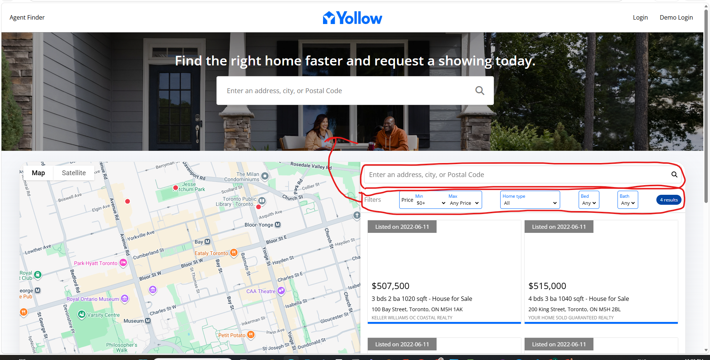
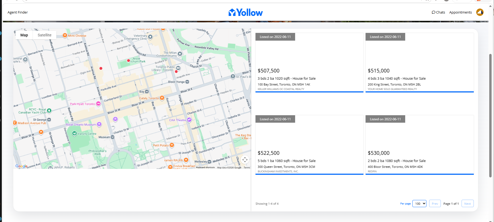
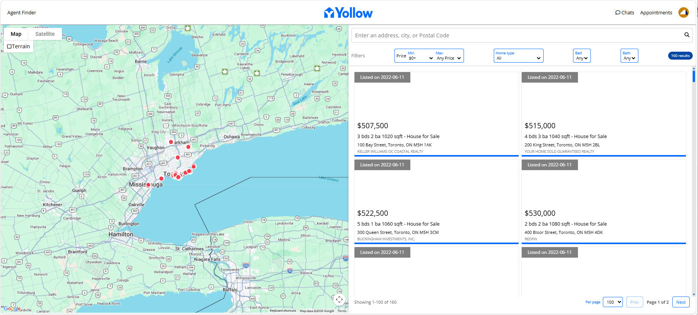

[lets fix home pages scroll bar](http://localhost:3001/) I think it is too long, it extends to the full length of the auto populated dropdown list - the dropdown list in search box should has its own scroll bar - not at the page level.
Fix the scroll bar both horizontally and vertically it should auto fit the content. No Scroll bar is needed.
Hide these two links: 
Redesign the main page, replace the Newly Listed section with Map search section,basically put the map.png view directly below the hero section
Add button below the text box 'Search by Map'
Lets change the 'map section' to the 'map and card list view' on main page
remove the 2nd search box in red circile, and move the filters to hero section below the 1st search box
The main page map should oversee an area that most close to the user's current location (allow track while using)
I only see a couple of properties on main page's map. would you be able to show all?

This container on main page is not perfect:  adjust it to look like the one on map search page: 

首页map view的房子还是很少，要像map view page那样覆盖整个gta的map

Add a seach by map button below search box on main page hero section