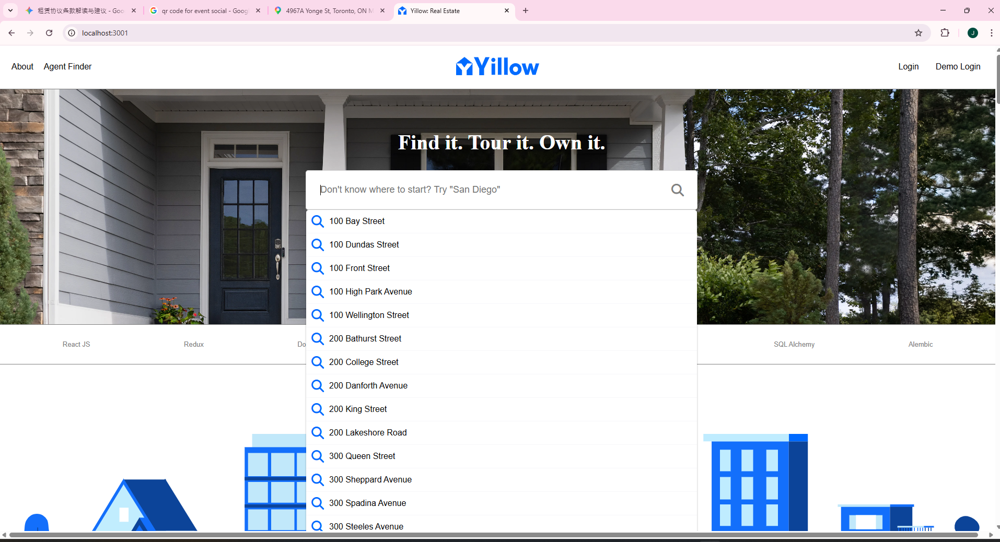
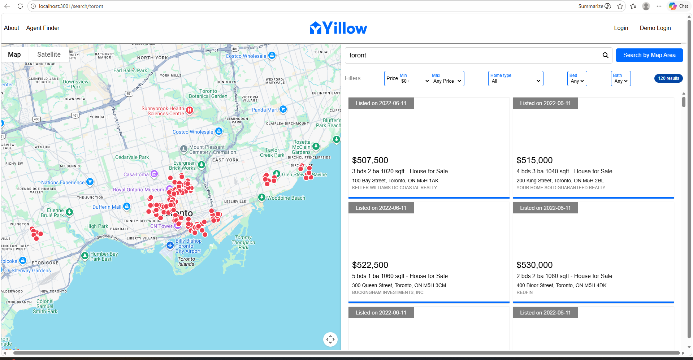

[lets fix home pages scroll bar](http://localhost:3001/) I think it is too long, it extends to the full length of the auto populated dropdown list - the dropdown list in search box should has its own scroll bar - not at the page level.
Fix the scroll bar both horizontally and vertically it should auto fit the content. No Scroll bar is needed.
Hide these two links: 